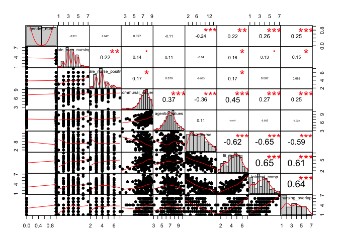

Analyses for Nursing Pilot Oct 2016
================
Kate Block
2016-10-22

``` r
library (tidyverse)
library (ggplot2)
library(knitr)
library(Hmisc)
```

reading file
------------

``` r
CLEAN_hetero <- read_csv("/Users/KatharinaBlock/Desktop/Git_REPOS/NursingDVPilot_oct2016/Nursing2pilot_clean_hetero.csv")
```

Making a mean overview

| vars          |      Female|        Male|
|:--------------|-----------:|-----------:|
| participants  |  93.0000000|  99.0000000|
| M\_communal   |   7.3620072|   7.1447811|
| M\_agentic    |   6.9754224|   7.2640693|
| M\_rankNurse  |   6.0000000|   7.8585859|
| M\_fit        |   4.7491039|   4.1868687|
| M\_positive   |   3.9677419|   3.8787879|
| M\_SNoverlap  |   3.9247312|   3.1010101|
| M\_interest   |   3.7956989|   3.0404040|
| M\_rate       |   3.6559140|   3.7878788|
| Sd\_rankNurse |   3.5934723|   4.0025760|
| Sd\_SNoverlap |   1.6301278|   1.5875469|
| Sd\_interest  |   1.3918606|   1.4531791|
| Sd\_agentic   |   1.2665276|   1.3848053|
| Sd\_communal  |   1.2483379|   0.9959232|
| Sd\_fit       |   1.2244055|   1.2565639|
| Sd\_rate      |   1.0053620|   1.1452896|
| Sd\_positive  |   0.8654179|   1.0129038|

Correlations
============

Correlations for FIT measure:
-----------------------------

LOOKING GREAT!

``` r
fitmeasure <- CLEAN_hetero[, c("fit1","fit2","fit3", "fit4", "fit5", "fit6")]
corrs1 <- rcorr (as.matrix(fitmeasure))
corrs1$r %>% kable ()
```

|      |       fit1|       fit2|       fit3|       fit4|       fit5|       fit6|
|------|----------:|----------:|----------:|----------:|----------:|----------:|
| fit1 |  1.0000000|  0.6850787|  0.6136234|  0.5844160|  0.5662511|  0.5389736|
| fit2 |  0.6850787|  1.0000000|  0.7904147|  0.5637980|  0.6772018|  0.5523527|
| fit3 |  0.6136234|  0.7904147|  1.0000000|  0.5766708|  0.6395782|  0.4754802|
| fit4 |  0.5844160|  0.5637980|  0.5766708|  1.0000000|  0.6375064|  0.6727729|
| fit5 |  0.5662511|  0.6772018|  0.6395782|  0.6375064|  1.0000000|  0.7020859|
| fit6 |  0.5389736|  0.5523527|  0.4754802|  0.6727729|  0.7020859|  1.0000000|

``` r
corrs1$P %>% kable ()
```

|      |  fit1|  fit2|  fit3|  fit4|  fit5|  fit6|
|------|-----:|-----:|-----:|-----:|-----:|-----:|
| fit1 |    NA|     0|     0|     0|     0|     0|
| fit2 |     0|    NA|     0|     0|     0|     0|
| fit3 |     0|     0|    NA|     0|     0|     0|
| fit4 |     0|     0|     0|    NA|     0|     0|
| fit5 |     0|     0|     0|     0|    NA|     0|
| fit6 |     0|     0|     0|     0|     0|    NA|

Correlations for INTEREST Measure:
----------------------------------

LOOKING GREAT!

``` r
interestmeasure <- CLEAN_hetero[, c("interest_nursing","enjoy_nursing","imagine_nursing")]
corrs2 <- rcorr (as.matrix(fitmeasure))
corrs2$r %>% kable ()
```

|      |       fit1|       fit2|       fit3|       fit4|       fit5|       fit6|
|------|----------:|----------:|----------:|----------:|----------:|----------:|
| fit1 |  1.0000000|  0.6850787|  0.6136234|  0.5844160|  0.5662511|  0.5389736|
| fit2 |  0.6850787|  1.0000000|  0.7904147|  0.5637980|  0.6772018|  0.5523527|
| fit3 |  0.6136234|  0.7904147|  1.0000000|  0.5766708|  0.6395782|  0.4754802|
| fit4 |  0.5844160|  0.5637980|  0.5766708|  1.0000000|  0.6375064|  0.6727729|
| fit5 |  0.5662511|  0.6772018|  0.6395782|  0.6375064|  1.0000000|  0.7020859|
| fit6 |  0.5389736|  0.5523527|  0.4754802|  0.6727729|  0.7020859|  1.0000000|

``` r
corrs2$P %>% kable ()
```

|      |  fit1|  fit2|  fit3|  fit4|  fit5|  fit6|
|------|-----:|-----:|-----:|-----:|-----:|-----:|
| fit1 |    NA|     0|     0|     0|     0|     0|
| fit2 |     0|    NA|     0|     0|     0|     0|
| fit3 |     0|     0|    NA|     0|     0|     0|
| fit4 |     0|     0|     0|    NA|     0|     0|
| fit5 |     0|     0|     0|     0|    NA|     0|
| fit6 |     0|     0|     0|     0|     0|    NA|

Overall correlation (MEN AND WOMEN)
-----------------------------------

I display these in different ways NOTES:

-   Communal values are related to all FIT, interest and rank. But MORE to fit and rank than interest.
-   We get gender differences in all three FIT, interest and rank
-   interestingly we don't get gender differences in communal values???

    |                    gen| der\_num rat | e\_men\_nursing mal | e\_nurse\_positive com | munal\_values age | ntic\_values ran | k\_nurse fit | \_nursing int | erest\_comp |
    |----------------------:|--------------|---------------------|------------------------|-------------------|------------------|--------------|---------------|:------------|
    |            gender\_num| 1.0000000    | -0.0612814          | 0.0472682              | 0.0965309         | -0.1084806       | -0.2380275   | 0.2219109     | 0.2575104   |
    |     rate\_men\_nursing| -0.0612814   | 1.0000000           | 0.2205480              | 0.1395007         | 0.1081959        | -0.0399454   | 0.1624604     | 0.1250158   |
    |  male\_nurse\_positive| 0.0472682    | 0.2205480           | 1.0000000              | 0.1727595         | 0.0791551        | -0.0831982   | 0.1671681     | 0.0872488   |
    |       communal\_values| 0.0965309    | 0.1395007           | 0.1727595              | 1.0000000         | 0.3701255        | -0.3568348   | 0.4482102     | 0.2664495   |
    |        agentic\_values| -0.1084806   | 0.1081959           | 0.0791551              | 0.3701255         | 1.0000000        | 0.1101166    | 0.0097131     | -0.0649606  |
    |            rank\_nurse| -0.2380275   | -0.0399454          | -0.0831982             | -0.3568348        | 0.1101166        | 1.0000000    | -0.6184070    | -0.6514257  |
    |           fit\_nursing| 0.2219109    | 0.1624604           | 0.1671681              | 0.4482102         | 0.0097131        | -0.6184070   | 1.0000000     | 0.6490603   |
    |         interest\_comp| 0.2575104    | 0.1250158           | 0.0872488              | 0.2664495         | -0.0649606       | -0.6514257   | 0.6490603     | 1.0000000   |

    |                    gen| der\_num rat | e\_men\_nursing mal | e\_nurse\_positive com | munal\_values age | ntic\_values ran | k\_nurse fit | \_nursing int | erest\_comp |
    |----------------------:|--------------|---------------------|------------------------|-------------------|------------------|--------------|---------------|:------------|
    |            gender\_num| NA           | 0.3984520           | 0.5150110              | 0.1828769         | 0.1341957        | 0.0008855    | 0.0019783     | 0.0003111   |
    |     rate\_men\_nursing| 0.3984520    | NA                  | 0.0021122              | 0.0536313         | 0.1352265        | 0.5822477    | 0.0243605     | 0.0840343   |
    |  male\_nurse\_positive| 0.5150110    | 0.0021122           | NA                     | 0.0165643         | 0.2751163        | 0.2512614    | 0.0204735     | 0.2288384   |
    |       communal\_values| 0.1828769    | 0.0536313           | 0.0165643              | NA                | 0.0000001        | 0.0000004    | 0.0000000     | 0.0001872   |
    |        agentic\_values| 0.1341957    | 0.1352265           | 0.2751163              | 0.0000001         | NA               | 0.1283894    | 0.8936291     | 0.3706866   |
    |            rank\_nurse| 0.0008855    | 0.5822477           | 0.2512614              | 0.0000004         | 0.1283894        | NA           | 0.0000000     | 0.0000000   |
    |           fit\_nursing| 0.0019783    | 0.0243605           | 0.0204735              | 0.0000000         | 0.8936291        | 0.0000000    | NA            | 0.0000000   |
    |         interest\_comp| 0.0003111    | 0.0840343           | 0.2288384              | 0.0001872         | 0.3706866        | 0.0000000    | 0.0000000     | NA          |



| row                   | column                |         cor|          p|
|:----------------------|:----------------------|-----------:|----------:|
| gender\_num           | rate\_men\_nursing    |  -0.0612814|  0.3984520|
| gender\_num           | male\_nurse\_positive |   0.0472682|  0.5150110|
| rate\_men\_nursing    | male\_nurse\_positive |   0.2205480|  0.0021122|
| gender\_num           | communal\_values      |   0.0965309|  0.1828769|
| rate\_men\_nursing    | communal\_values      |   0.1395007|  0.0536313|
| male\_nurse\_positive | communal\_values      |   0.1727595|  0.0165643|
| gender\_num           | agentic\_values       |  -0.1084806|  0.1341957|
| rate\_men\_nursing    | agentic\_values       |   0.1081959|  0.1352265|
| male\_nurse\_positive | agentic\_values       |   0.0791551|  0.2751163|
| communal\_values      | agentic\_values       |   0.3701255|  0.0000001|
| gender\_num           | rank\_nurse           |  -0.2380275|  0.0008855|
| rate\_men\_nursing    | rank\_nurse           |  -0.0399454|  0.5822477|
| male\_nurse\_positive | rank\_nurse           |  -0.0831982|  0.2512614|
| communal\_values      | rank\_nurse           |  -0.3568348|  0.0000004|
| agentic\_values       | rank\_nurse           |   0.1101166|  0.1283894|
| gender\_num           | fit\_nursing          |   0.2219109|  0.0019783|
| rate\_men\_nursing    | fit\_nursing          |   0.1624604|  0.0243605|
| male\_nurse\_positive | fit\_nursing          |   0.1671681|  0.0204735|
| communal\_values      | fit\_nursing          |   0.4482102|  0.0000000|
| agentic\_values       | fit\_nursing          |   0.0097131|  0.8936291|
| rank\_nurse           | fit\_nursing          |  -0.6184070|  0.0000000|
| gender\_num           | interest\_comp        |   0.2575104|  0.0003111|
| rate\_men\_nursing    | interest\_comp        |   0.1250158|  0.0840343|
| male\_nurse\_positive | interest\_comp        |   0.0872488|  0.2288384|
| communal\_values      | interest\_comp        |   0.2664495|  0.0001872|
| agentic\_values       | interest\_comp        |  -0.0649606|  0.3706866|
| rank\_nurse           | interest\_comp        |  -0.6514257|  0.0000000|
| fit\_nursing          | interest\_comp        |   0.6490603|  0.0000000|

Correlations JUST FOR MEN!
==========================

|                       |  rate\_men\_nursing|  male\_nurse\_positive|  communal\_values|  agentic\_values|  rank\_nurse|  fit\_nursing|  interest\_comp|
|-----------------------|-------------------:|----------------------:|-----------------:|----------------:|------------:|-------------:|---------------:|
| rate\_men\_nursing    |           1.0000000|              0.2326970|         0.2478697|        0.0687668|   -0.1379426|     0.3303507|       0.2565778|
| male\_nurse\_positive |           0.2326970|              1.0000000|         0.1659322|       -0.0382632|   -0.0420246|     0.1302183|       0.0819289|
| communal\_values      |           0.2478697|              0.1659322|         1.0000000|        0.3276650|   -0.3220410|     0.3577680|       0.3182880|
| agentic\_values       |           0.0687668|             -0.0382632|         0.3276650|        1.0000000|    0.1006952|    -0.0170592|      -0.0099438|
| rank\_nurse           |          -0.1379426|             -0.0420246|        -0.3220410|        0.1006952|    1.0000000|    -0.6682702|      -0.6533786|
| fit\_nursing          |           0.3303507|              0.1302183|         0.3577680|       -0.0170592|   -0.6682702|     1.0000000|       0.6856524|
| interest\_comp        |           0.2565778|              0.0819289|         0.3182880|       -0.0099438|   -0.6533786|     0.6856524|       1.0000000|

|                       |  rate\_men\_nursing|  male\_nurse\_positive|  communal\_values|  agentic\_values|  rank\_nurse|  fit\_nursing|  interest\_comp|
|-----------------------|-------------------:|----------------------:|-----------------:|----------------:|------------:|-------------:|---------------:|
| rate\_men\_nursing    |                  NA|              0.0204594|         0.0133729|        0.4988295|    0.1733244|     0.0008394|       0.0103604|
| male\_nurse\_positive |           0.0204594|                     NA|         0.1007067|        0.7069044|    0.6795980|     0.1989047|       0.4201356|
| communal\_values      |           0.0133729|              0.1007067|                NA|        0.0009306|    0.0011515|     0.0002773|       0.0013244|
| agentic\_values       |           0.4988295|              0.7069044|         0.0009306|               NA|    0.3213420|     0.8669034|       0.9221821|
| rank\_nurse           |           0.1733244|              0.6795980|         0.0011515|        0.3213420|           NA|     0.0000000|       0.0000000|
| fit\_nursing          |           0.0008394|              0.1989047|         0.0002773|        0.8669034|    0.0000000|            NA|       0.0000000|
| interest\_comp        |           0.0103604|              0.4201356|         0.0013244|        0.9221821|    0.0000000|     0.0000000|              NA|


| row                   | column                |         cor|          p|
|:----------------------|:----------------------|-----------:|----------:|
| rate\_men\_nursing    | male\_nurse\_positive |   0.2326970|  0.0204594|
| rate\_men\_nursing    | communal\_values      |   0.2478697|  0.0133729|
| male\_nurse\_positive | communal\_values      |   0.1659322|  0.1007067|
| rate\_men\_nursing    | agentic\_values       |   0.0687668|  0.4988295|
| male\_nurse\_positive | agentic\_values       |  -0.0382632|  0.7069044|
| communal\_values      | agentic\_values       |   0.3276650|  0.0009306|
| rate\_men\_nursing    | rank\_nurse           |  -0.1379426|  0.1733244|
| male\_nurse\_positive | rank\_nurse           |  -0.0420246|  0.6795980|
| communal\_values      | rank\_nurse           |  -0.3220410|  0.0011515|
| agentic\_values       | rank\_nurse           |   0.1006952|  0.3213420|
| rate\_men\_nursing    | fit\_nursing          |   0.3303507|  0.0008394|
| male\_nurse\_positive | fit\_nursing          |   0.1302183|  0.1989047|
| communal\_values      | fit\_nursing          |   0.3577680|  0.0002773|
| agentic\_values       | fit\_nursing          |  -0.0170592|  0.8669034|
| rank\_nurse           | fit\_nursing          |  -0.6682702|  0.0000000|
| rate\_men\_nursing    | interest\_comp        |   0.2565778|  0.0103604|
| male\_nurse\_positive | interest\_comp        |   0.0819289|  0.4201356|
| communal\_values      | interest\_comp        |   0.3182880|  0.0013244|
| agentic\_values       | interest\_comp        |  -0.0099438|  0.9221821|
| rank\_nurse           | interest\_comp        |  -0.6533786|  0.0000000|
| fit\_nursing          | interest\_comp        |   0.6856524|  0.0000000|
